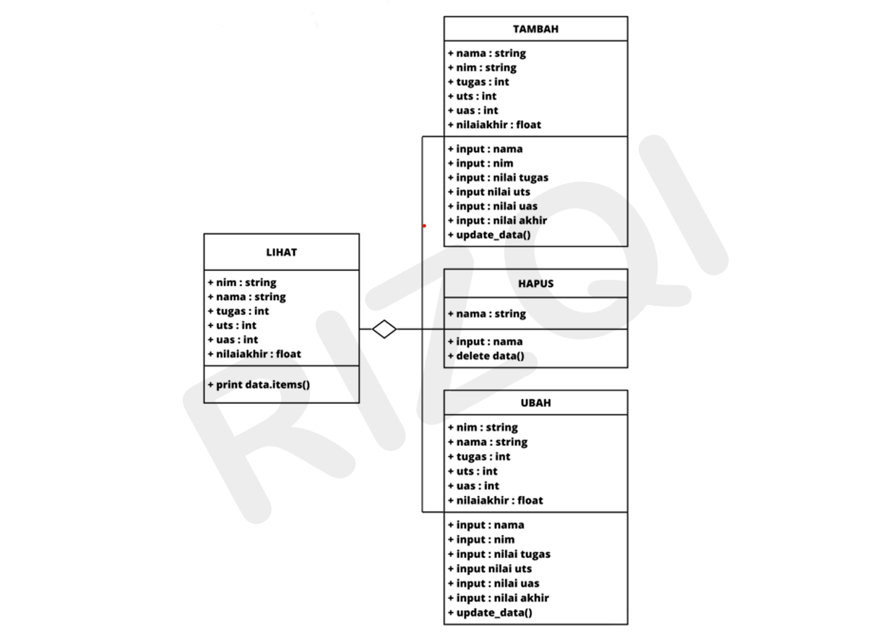

## **PROGRAM INPUT NILAI MAHASISWA MENGGUNAKAN OBJECT ORIENTED PROGRAMING(OOP)**

### **PENGERTIAN OOP**
- **object-oriented-programing/OOP** adalah paradigma pemrograman berdasarkan konsep "objek", yang dapat berisi data, dalam bentuk field atau dikenal juga sebagai atribut; serta kode, dalam bentuk fungsi/prosedur atau dikenal juga sebagai method.
<br>

```sh
dataMahasiswa = {}

class mahasiswa(object):
        def tambah():
                nama = str(input("Masukan Nama : "))
                nim = int(input("Masukan Nim   : "))
                tugas = int(input("Masukan Nilai Tugas : "))
                uts = int(input("Masukan Nilai UTS     : "))
                uas = int(input("Masukan Nilai UAS     : "))
                akhir = (tugas / 3) + (uts / 3.5) + (uas / 3.5)
                dataMahasiswa[nama] = nim, tugas, uts, uas, akhir,
                print("\33[32m\nDATA BERHASIL DI TAMBAHKAN!")
        def tampilkan():
                print('\033[1m','\33[34m')
                print("=" * 61)
                print("|" + "\t" * 2 + "DAFTAR NILAI MAHASISWA" + "\t" * 3 +
                        "    |")
                print("=" * 61)
                print("|   \tNAMA\t   |\tNIM \t| TUGAS | UTS | UAS | AKHIR |")
                print("=" * 61)
                for tampil in dataMahasiswa.items():
                    print("| {0:15}   | {1:9} | {2:5} | {3:3} | {4:3} | {5:5} |".format(tampil[0], tampil[1][0], tampil[1][1], tampil[1][2], tampil[1][3],"%.2f" % float(tampil[1][4])))
                    print("=" * 61)
        def hapus(nama):
                    del dataMahasiswa[nama]
                    print("\33[31mDATA BERHASIL DI HAPUS!")
                    
        
        def ubah(nama):
                if nama in dataMahasiswa.keys():
                    nim = int(input("Masukan Nim  : "))
                    tugas = int(input("Masukan Nilai Tugas : "))
                    uts = int(input("Masukan Nilai UTS     : "))
                    uas = int(input("Masukan Nilai UAS     : "))
                    akhir = (tugas / 3) + (uts / 3.5) + (uas / 3.5)
                    dataMahasiswa[nama] = nim, tugas, uts, uas, akhir
                    print("\33[33m\nDATA BERHASIL DI UBAH!")
                else:
                    print("\33[31m\DATA TIDAK DI TEMUKAN!")
while True:
    data = input("\033[1m \33[34m \n 1 - Tambah Data\t 2 - Tampilkan Data\t 3 - Hapus Data\t 4 - Ubah Data\t 5 - Keluar \n : "
    )
    if (data.lower() == '1'):
        mahasiswa.tambah()

    elif (data.lower() == '4'):
        nama = str(input("Masukan Nama : "))
        mahasiswa.ubah(nama)
    elif (data.lower() == '3'):
        nama = str(input("Masukan Nama : "))
        if nama in dataMahasiswa:
            mahasiswa.hapus(nama)
        else:
            print("\33[31mDATA TIDAK DI TEMUKAN ".format(nama))
    elif (data.lower() == '2'):
        if dataMahasiswa.items():
            mahasiswa.tampilkan()
        else:
            print('\033[1m','\33[34m')
            print("=" * 61)
            print("|" + "\t" * 3 + "DAFTAR NILAI MAHASISWA" + "\t" * 3 +
                  "    |")
            print("=" * 61)
            print("| NO |   \tNAMA\t   |\tNIM \t| TUGAS | UTS | UAS | AKHIR |")
            print("=" * 61)
            print("|    " + "\t" * 3 + "\33[31mTIDAK ADA DATA!" + "\t" * 4 + "    |")
            print("=" * 61)
    elif (data.lower() == '5'):
        print("\33[7m\nTERIMA KASIH! \n")
        print('\33[30m')
        exit()
    else:
        print("\33[31mPILIHAN MENU TIDAK ADA!")
```

## **PENJELASAN**<br>
## 1. deklarasi *dataMahasasiwa* sebagai object untuk menerima inputan data.<br>
## 2. deklarasi *class* di isi dengan method:
### - def tambah() di isi dengan inputan *nama, nim, tugas, uts, uas, akhir* , di variable akhir di isi dengan penjumlahan dan bagi 3, untuk tugas 3.5 untuk uts, 3.5 untuk uas. terakhir masukan semua kedalam object *dataMahasiswa*.

### - def tampil() untuk mencetak object *dataMahasiwa* serta gunakan perulangan *for* untuk mecetak semua data jika di dalam object  *dataMahasiwa* berisi banyak data.
### - def hapus(nama) untuk menghapus data di dalam parameter nama dan gunakan syntax *del*.
### - def ubah(nama) untuk mengubah data di dalam parameter nama  dan gunakan statment *if else nama di dalam dataMahasiswa* lalu masukan kembali ke dalam object *dataMahasiswa*.<br>
## 3. gunakan pengulangan *while True* di isikan dengan inputan menu, lalu di dalamnya di isikan dengan statment *if elif else*.
## 4. di dalam statment *if elif else* di isikan dengan memanggil masing-masing method yang ada di dalam *class mahasiswa*.
## selesai
## **FLOWCHART**

## **DIAGRAM CLASS**
